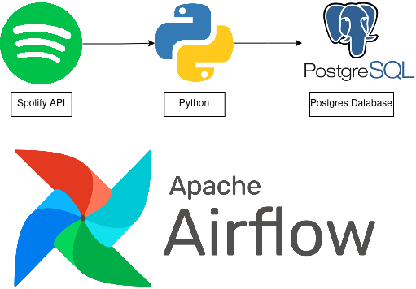

# Spotify-Data-Pipeline
The Spotify Data Pipeline is an ETL (Extract, Transform, Load) system that extracts daily played tracks from the Spotify API, performs data transformation and validation using Python, and then uploads the processed data to a local Postgres database. The entire workflow is orchestrated using Apache Airflow.

## Overview

The pipeline is designed to collect data on tracks played in the last 24 hours from the Spotify API. It uses the spotipy module to handle authentication for the Spotify API, and you will need to register your application in the Spotify Developer Dashboard to obtain the ClientID and ClientSecret required for authentication.
 

## Components
1. **Data Extraction**: The pipeline uses the spotipy Python module to interact with the Spotify API and fetch data on daily played tracks. Note that the Spotify API only allows a maximum of **50** per request 

2. **Data Transformation**: The extracted data is then transformed using Python to clean, preprocess, and format it for further processing.

3. **Data Validation**: Data validation steps are performed to ensure data integrity and accuracy. Any invalid or erroneous data is flagged and handled appropriately.

4. **Data Loading**: The validated data is uploaded to a local Postgres database for archiving and analysis

5. **Orchestration**: Apache Airflow is used to orchestrate the entire ETL workflow. It schedules and monitors the execution of each step.
